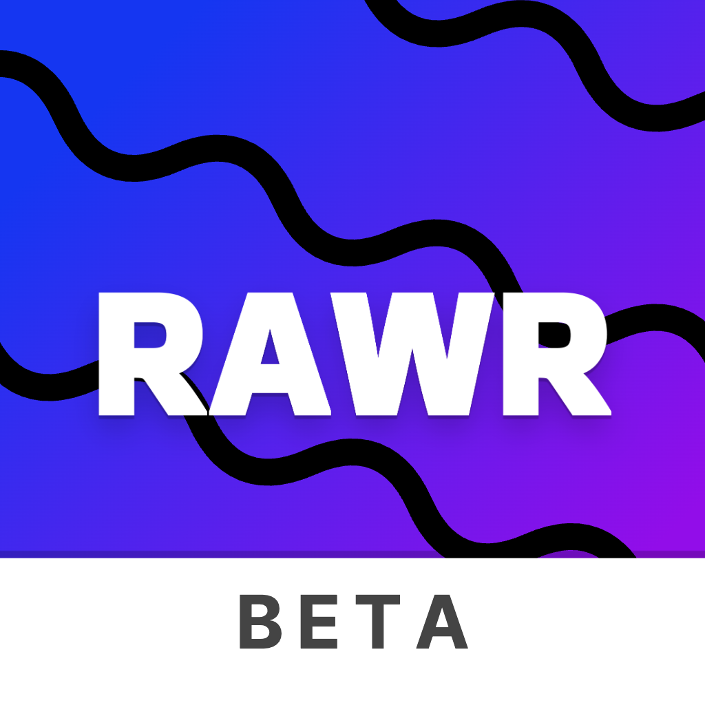
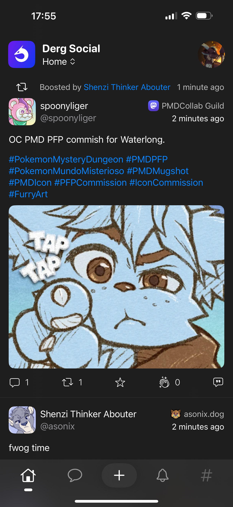

<!-- PROJECT SHIELDS -->
<!--
*** I'm using markdown "reference style" links for readability.
*** Reference links are enclosed in brackets [ ] instead of parentheses ( ).
*** See the bottom of this document for the declaration of the reference variables
*** for contributors-url, forks-url, etc. This is an optional, concise syntax you may use.
*** https://www.markdownguide.org/basic-syntax/#reference-style-links
-->

[![Contributors][contributors-shield]][contributors-url]
[![Forks][forks-shield]][forks-url]
[![Stargazers][stars-shield]][stars-url]
[![Issues][issues-shield]][issues-url]
[![MIT License][license-shield]][license-url]

 

  

<h3 align="center">rawr.</h3>

  

    An iOS native client for Firefish, written in SwiftUI.
     
    <a href="https://testflight.apple.com/join/ltx6zpow">Join Testflight</a>
    ·
    <a href="https://github.com/infinytum/rawr/issues">Report Bug</a>
    ·
    <a href="https://github.com/infinytum/rawr/issues">Request Feature</a>
  

  

[![Swift][Swift.org]][Swift-url]
[![Xcode][Xcode]][Xcode-url]

  

<!-- TABLE OF CONTENTS -->

  
Table of Contents

  <ol>
    <li>
      <a href="#about-the-project">About The Project</a>
    </li>
    <li>
      <a href="#getting-started">Getting Started</a>
      <ul>
        <li><a href="#prerequisites">Prerequisites</a></li>
        <li><a href="#installation">Installation</a></li>
      </ul>
    </li>
    <li><a href="#screenshots">Screenshots</a></li>
    <li><a href="#contributing">Contributing</a></li>
    <li><a href="#license">License</a></li>
    <li><a href="#contact">Contact</a></li>
    <li><a href="#acknowledgments">Acknowledgments</a></li>
  </ol>

<!-- ABOUT THE PROJECT -->

## About The Project

**rawr.** was created due to the lack of proper firefish clients for the iOS platform. While many fediverse apps can work with Firefish through its Mastodon API compatibility layer, the experience is not great and it will never feel quite right. **rawr.** aims to provide a Firefish-native experience, using the native firefish API. (Modified Misskey API)

The app is still young and does not have feature-parity with the web client. If you are an iOS developer and you are willing to deal with SwiftUI (I avoid UIKit like the pest), please do contribute to the project!

(<a href="#readme-top">back to top</a>)

<!-- GETTING STARTED -->

## Getting Started

### Prerequisites

All you need is an account on any firefish instance out there and an iPhone running at least iOS 16.

### Installation

1. Download the beta using [Testflight](https://testflight.apple.com/join/ltx6zpow)
2. Choose your server in the app or enter the instance domain using "Other Instance"
3. Follow the login procedure and enjoy!

(<a href="#readme-top">back to top</a>)

## Screenshots

  

(<a href="#readme-top">back to top</a>)

<!-- CONTRIBUTING -->

## Contributing

Contributions are what make the open source community such an amazing place to learn, inspire, and create. Any contributions you make are **greatly appreciated**.

If you have a suggestion that would make this better, please fork the repo and create a pull request. You can also simply open an issue with the tag "enhancement".
Don't forget to give the project a star! Thanks again!

1. Fork the Project
2. Create your Feature Branch (`git checkout -b feature/AmazingFeature`)
3. Commit your Changes (`git commit -m 'Add some AmazingFeature'`)
4. Push to the Branch (`git push origin feature/AmazingFeature`)
5. Open a Pull Request

(<a href="#readme-top">back to top</a>)

<!-- LICENSE -->

## License

Distributed under the GPL-3.0 License. See `LICENSE` for more information.

(<a href="#readme-top">back to top</a>)

<!-- CONTACT -->

## Contact

NilaTheDragon - [@nila@derg.social](https://derg.social/@nila)  
Project Link: [https://github.com/infinytum/rawr](https://github.com/infinytum/rawr)

(<a href="#readme-top">back to top</a>)

<!-- ACKNOWLEDGMENTS -->

## Acknowledgments

- [Keychain Swift](https://github.com/evgenyneu/keychain-swift)
- [NetworkImage](https://github.com/gonzalezreal/NetworkImage)
- [WrappingHStack](https://github.com/ksemianov/WrappingHStack)
- [Original MisskeyKit](https://github.com/YuigaWada/MisskeyKit-for-iOS)

(<a href="#readme-top">back to top</a>)

<!-- MARKDOWN LINKS & IMAGES -->
<!-- https://www.markdownguide.org/basic-syntax/#reference-style-links -->

[contributors-shield]: https://img.shields.io/github/contributors/infinytum/rawr.svg?style=for-the-badge
[contributors-url]: https://github.com/infinytum/rawr/graphs/contributors
[forks-shield]: https://img.shields.io/github/forks/infinytum/rawr.svg?style=for-the-badge
[forks-url]: https://github.com/infinytum/rawr/network/members
[stars-shield]: https://img.shields.io/github/stars/infinytum/rawr.svg?style=for-the-badge
[stars-url]: https://github.com/infinytum/rawr/stargazers
[issues-shield]: https://img.shields.io/github/issues/infinytum/rawr.svg?style=for-the-badge
[issues-url]: https://github.com/infinytum/rawr/issues
[license-shield]: https://img.shields.io/github/license/infinytum/rawr.svg?style=for-the-badge
[license-url]: https://github.com/infinytum/rawr/blob/master/LICENSE.txt
[product-screenshot]: assets/screenshot.png
[Swift.org]: https://img.shields.io/badge/swift-F54A2A?style=for-the-badge&logo=swift&logoColor=white
[Swift-url]: https://swift.org
[Xcode]: https://img.shields.io/badge/Xcode-007ACC?style=for-the-badge&logo=Xcode&logoColor=white
[Xcode-url]: https://developer.apple.com/xcode/
